# Informações do Projeto
`HelPet`  

`Trabalho Interdisciplinar de Aplicações Web`

## Participantes

* Amanda Mourthe Marques Villaça Veiga
* Hugo Santiago Xavier
* João Vitor Gonçalves Del Cantoni Baldo
* Maria Cândida Torres Ferreira Costa Guerra
* Roberto Rassendil Carvalho da Cunha Peixotoe

# Estrutura do Documento

- [Informações do Projeto](#informações-do-projeto)
  - [Participantes](#participantes)
- [Estrutura do Documento](#estrutura-do-documento)
- [Introdução](#introdução)
  - [Problema](#problema)
  - [Objetivos](#objetivos)
  - [Justificativa](#justificativa)
  - [Público-Alvo](#público-alvo)
- [Especificações do Projeto](#especificações-do-projeto)
  - [Personas e Mapas de Empatia](#personas-e-mapas-de-empatia)
  - [Histórias de Usuários](#histórias-de-usuários)
  - [Requisitos](#requisitos)
    - [Requisitos Funcionais](#requisitos-funcionais)
    - [Requisitos não Funcionais](#requisitos-não-funcionais)
  - [Restrições](#restrições)
- [Projeto de Interface](#projeto-de-interface)
  - [User Flow](#user-flow)
  - [Wireframes](#wireframes)
- [Metodologia](#metodologia)
  - [Divisão de Papéis](#divisão-de-papéis)
  - [Ferramentas](#ferramentas)
  - [Controle de Versão](#controle-de-versão)
- [**############## SPRINT 1 ACABA AQUI #############**](#-sprint-1-acaba-aqui-)
- [Projeto da Solução](#projeto-da-solução)
  - [Tecnologias Utilizadas](#tecnologias-utilizadas)
  - [Arquitetura da solução](#arquitetura-da-solução)
- [Avaliação da Aplicação](#avaliação-da-aplicação)
  - [Plano de Testes](#plano-de-testes)
  - [Ferramentas de Testes (Opcional)](#ferramentas-de-testes-opcional)
  - [Registros de Testes](#registros-de-testes)
- [Referências](#referências)

# Introdução

## Problema

No mundo de hoje, muitas pessoas possuem algum tipo de animal doméstico no qual possuem muito amor e afeto, e perde-lo não é algo fácil. Para auxiliar nesse problema, tivemos a idéia de criar um software que ajude esse reencontro a ser mais rapido, já que os métodos utilizados nessa busca são ultrapassados e não completamente eficazes.

## Objetivos

O objetivo do nosso projeto é criar um software que auxilie pessoas que perderam seus animais a encontra-los sem depender de pregar cartazes em postes pela rua ou divulgar em redes sociais, o que não é exatamente preciso.

## Justificativa

Visando auxiliar os donos de animais e os próprios animais a encontrarem seus donos, esse projeto tem sua importância na parte de divulgar casos de animais perdidos, tendo em vista que os métodos utilizados atualmente não são completamente precisos.

## Público-Alvo

O público alvo do projeto são pessoas donas de animais (de qualquer tipo), qualquer pessoa que queira ajudar, ONGs, Lojas especializadas em animais (Pet-Shops e afins).
Onde eles possuem um conhecimento básico sobre a tecnologia e como acessar um site ou baixar um aplicativo para celular.

# Especificações do Projeto

Nessa parte do documento será aboradada as partes das personas junto aos mapas de empatia, que foram feitos utilizando a plataforma do [Miro](https://miro.com) e sendo baseado nas técnicas do design thinking para o desenvolvimento.

## Personas e Mapas de Empatia

> **Persona - Fernanda**
> 
> 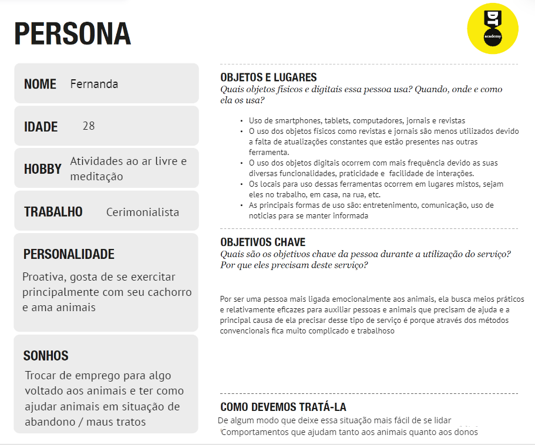

> **Mapa de empatia - Fernanda**
> 
> 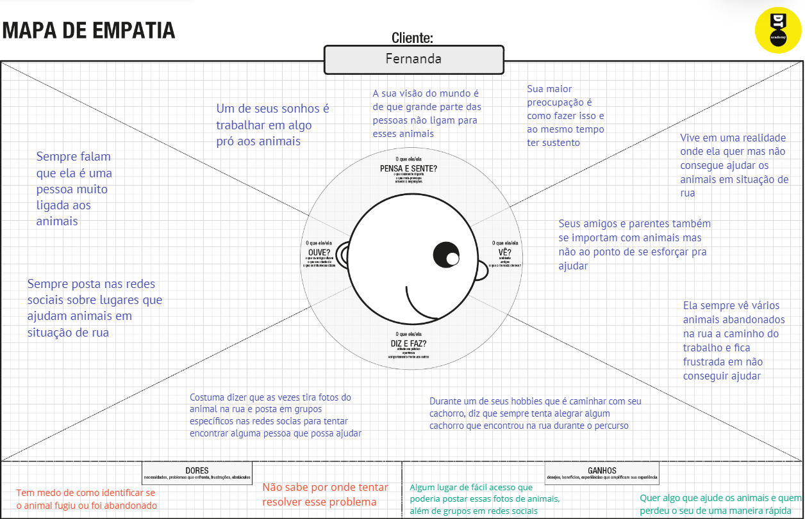

> **Persona - PetShop**
> 
> 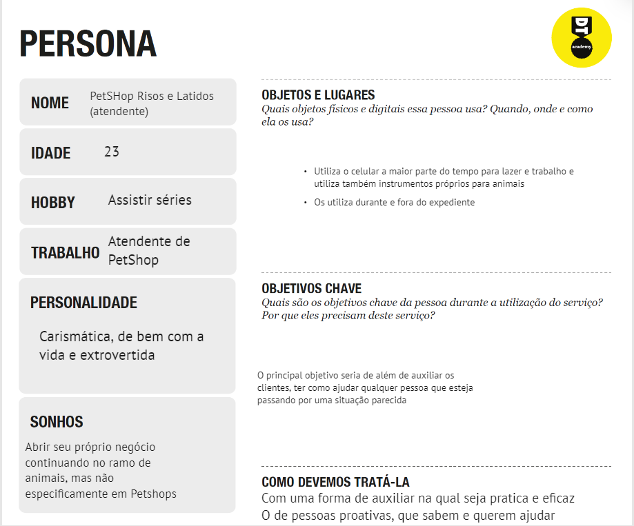

> **Mapa de empatia - PetShop**
> 
> 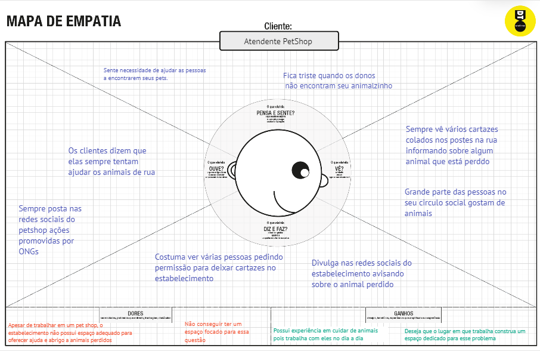

> **Persona - Ricardo**
> 
> 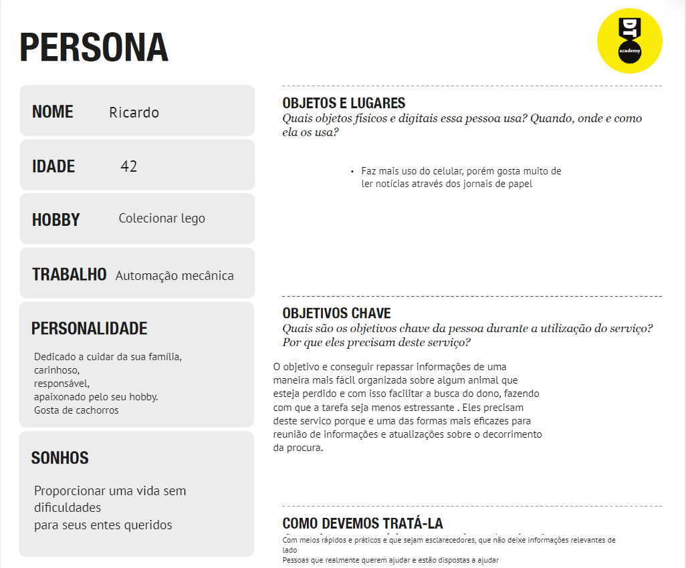

> **Mapa de empatia - Ricardo**
> 
> 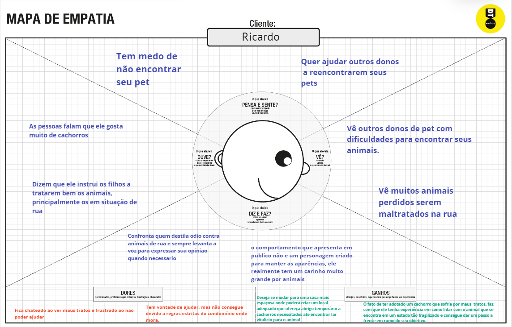

## Histórias de Usuários

Com base na análise das personas forma identificadas as seguintes histórias de usuários:

| Quem | Quero| Para Que |
| :---         |     :---:      |          ---: |
| Eu como Ricardo,dono de pets | quero ajudar no resgate de animais perdidos |Para trazer felicidade aos seus donos.|
| Eu como Fernanda, adoradora de pets | Quero acolher e cuidar de animais perdidos | Para que isso me ajude no meu trabalho dos sonhos |
| Eu como atendente de Pet Shop  |  Quero fazer resgates a animais | Para que eu me sinta bem comigo mesma |

## Requisitos

As tabelas que se seguem apresentam os requisitos funcionais e não funcionais que detalham o escopo do projeto.

### Requisitos Funcionais

|ID    | Descrição do Requisito  | Prioridade |
|------|-----------------------------------------|----|
|RN-01| Permitir que o programa acesse a localização do usuário | ALTA | 
|RN-02| Mostrar animais perdidos na localidade    | MÉDIA |
|RN-03| Permitir que o usuário publique no programa | ALTA | 
|RN-04| Mostrar para todos os usuários próximos as publicações do usuário   | ALTA |
|RN-05| Permitir que um usuário entre em contato com o outro | ALTA | 
|RN-06| Permitir novos cadastros de usuário   | MÉDIA |
|RN-07| Permitir que os usuários cadastrem novos animais | ALTA | 
|RN-08| Permitir que o usuário coloque fotos dos animais | MÉDIA |
|RN-09| Poder acessar com a internet | ALTA | 

### Requisitos não Funcionais

|ID     | Descrição do Requisito  |Prioridade |
|-------|-------------------------|----|
|RNF-01| Poder compartilhar as publicações em outras redes sociais | BAIXA| 
|RNF-02| Rodar em celulares com android com a versão superior 6.0 |  BAIXA | 
|RNF-03| O programa deverá funcionar em todos os sistemas | ALTA | 
|RNF-04| Notificar quando algum usuário publicar um animal perdido próximo |  MÉDIA |

## Restrições

O projeto está restrito pelos itens apresentados na tabela a seguir.

|ID| Restrição                                             |
|--|-------------------------------------------------------|
|01| O projeto deverá ser entregue até o final do semestre |
|02| Não pode ser desenvolvido um módulo de backend        |

# Projeto de Interface

As interfaces de solução foram feitas usando dois softwares: MarvelApp e FIGMA.
O fluxo do usuário foi feito para que seja definido a melhor e mais facil rota para a utilização do site, mostrando o que acontece dependendo da decisão feita 
pelo usuário.
O Wireframe das telas foi feito para que atenda os requisitos pedidos pelos usuarios, os entregando um site auto-intuitivo, fácil e prático. O wireframe possui 6 telas
que são o necessário para que o objetivo final do usuário seja alcançado. Todas as 6 telas sao interligadas agilizando a forma de uso do site e mostrando as 
ferramentas pedidas como: mapa, criação de perfis, comunicação entre usuários, publicações feitas pelos usuários, uso de fotos, etc.
Todo esse conjunto resolve o objetivo coletivo que é a busca pelo seu animal de estimação desaparecido.

## User Flow

> **Fluxo de usuário**:
> 
> 

## Wireframes

> **Login**:
> 
> 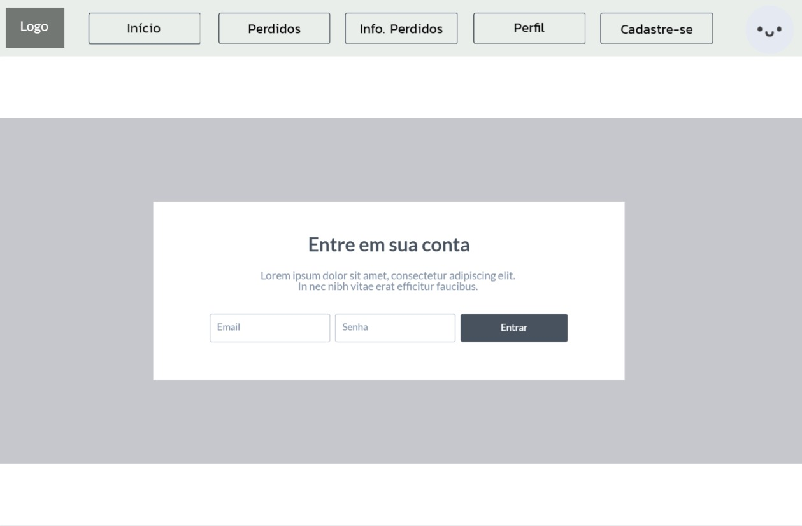

> **Cadastro do usuário**:
> 
> 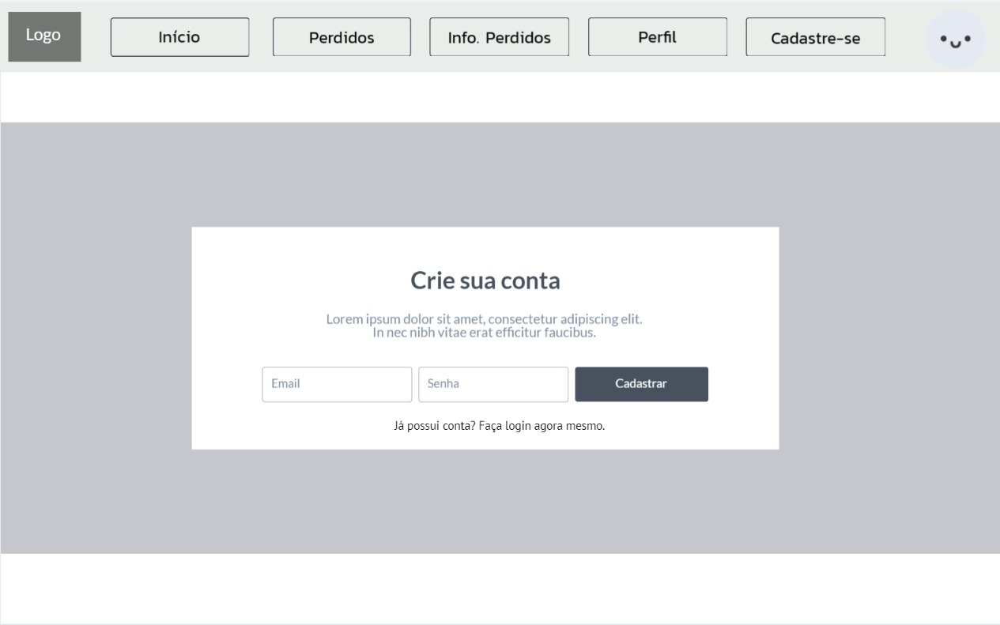

> **Perfil**:
> 
> 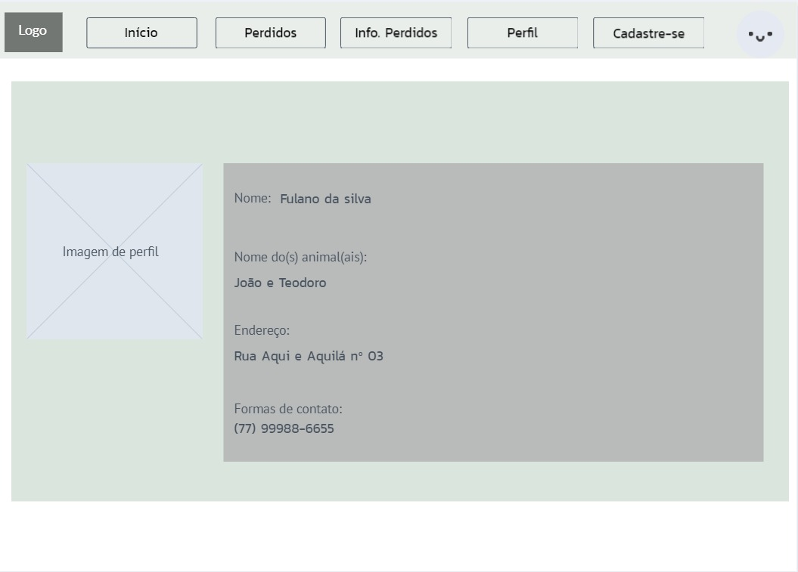

> **Home**:
> 
> 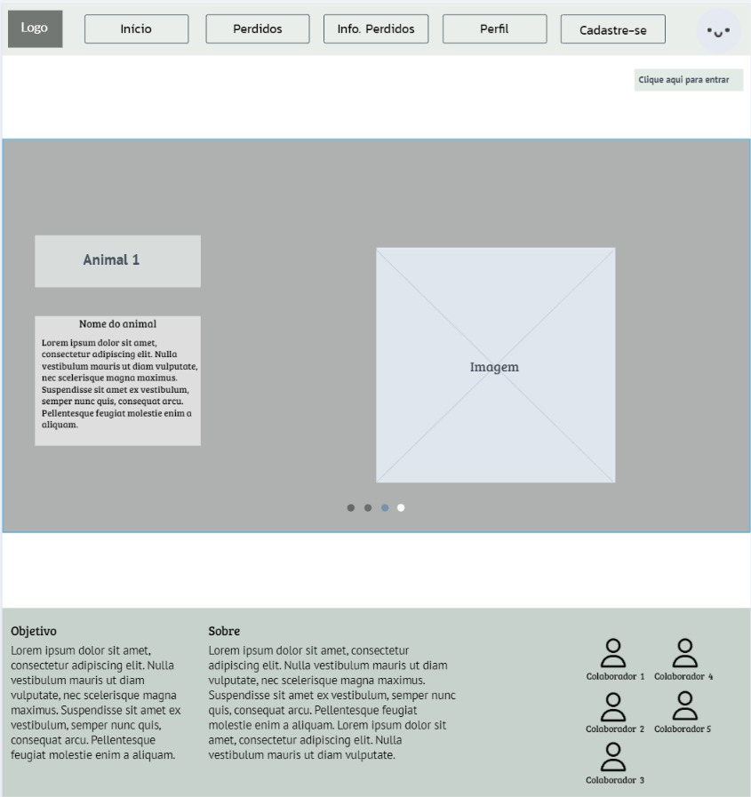

> **Animais perdidos**:
> 
> 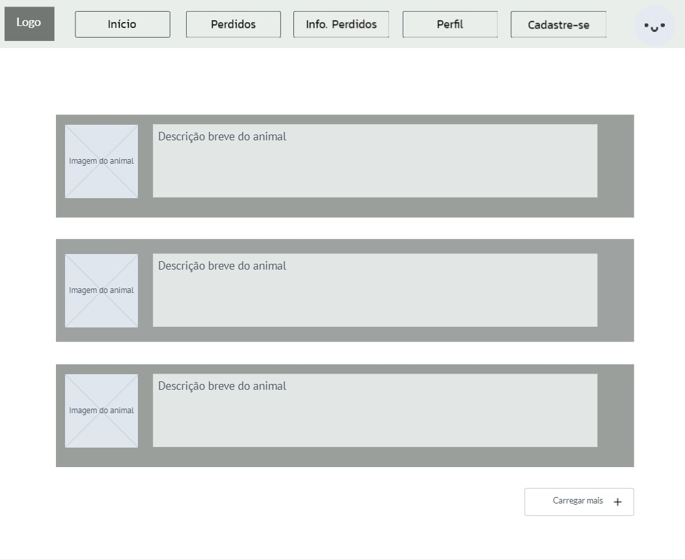

> **Mais informações sobre o animal**:
> 
> 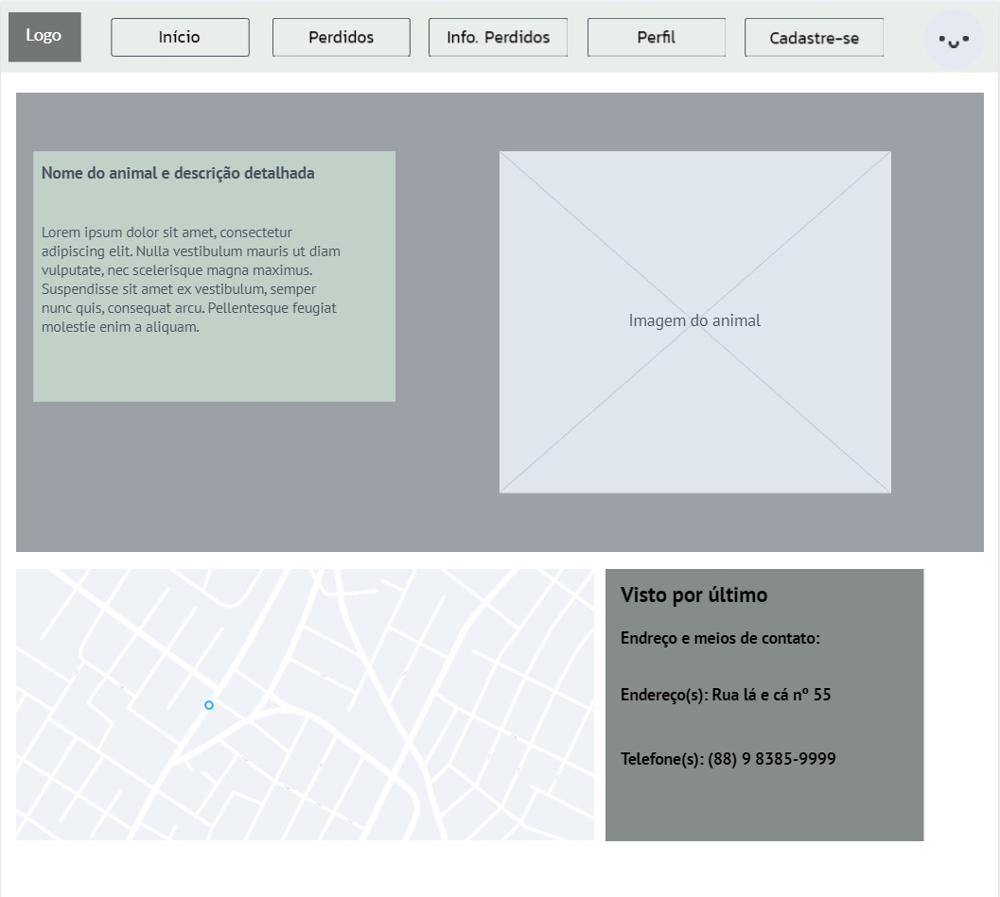

# Metodologia

O projeto está sendo feito com cada integrante possuindo uma determinada função, e contando com a ajuda dos demais caso necessite e o scrum master
realizando a própria função e auxiliando os demais.

As ferramentas que estão sendo utilizadas no momento são [Miro](https://miro.com/), para definir as ideias, [MarvelApp](https://marvelapp.com/), para construir o wireframe do site, [Github](https://github.com/), para controlar o versionamento do codigo, [Trello](https://trello.com/en), para organizar as tarefas e [Discord](https://discord.com/), onde são feitas as reuniões. 

## Divisão de Papéis

| Integrante    | Função        |
| ------------- | ------------- |
| Hugo        | Design, redação e Scrum Master  |
| Maria        | Redação  |
| Roberto  | Design  |
| Amanda        | Design  |
| João        | Redação  |

## Ferramentas

| Ambiente  | Plataforma              |Link de Acesso |
|-----------|-------------------------|---------------|
|Processo de Design Thinking  | Miro | https://miro.com/app/board/uXjVOBuEnd0=/ | 
|Repositório de código | GitHub | https://github.com/ICEI-PUC-Minas-PPLCC-TI/tiaw-ppl-cc-m-20221-animais-perdidos | 
|Hospedagem do site | Heroku |  https://XXXXXXX.herokuapp.com | 
|Protótipo Interativo | MavelApp | https://marvelapp.com/prototype/177gd1ae | 

Outras ferramentas utilizadas no projeto:

**Editor de código**
- Visual Studio Code
> IDE onde é possível aumentar a produtividade com a utilização de extensões

**Comunicação**
- [Discord](https://discord.com/)
- Podendo migrar para o [Slack](https://slack.com/)
> Aplicativos voltados a comunicação, sendo o Slack mais próprio para trabalhos

**Diagramação**
- [Figma](https://www.figma.com/)
> Plataforma onde foi feita a diagramação do fluxo de usuários, foi escolhida por ser bem simples e prática

**Hospedagem**
>Será atualizada quando o site começar a ser desenvolvido, porém já temos alguns em mente, como exemplo o [netlify](https://www.netlify.com/) 

## Controle de Versão

O controle de versão do git que está sendo utilizado no momento é de que todos os integrantes podem dar commit na branch `master`, porém no decorrer do projeto será alterado para commits em `branchs separadas` e depois mescladas com a `master` e utilizando um modelo de `tags` a ser definido.

# **############## SPRINT 1 ACABA AQUI #############**

# Projeto da Solução

......  COLOQUE AQUI O SEU TEXTO ......

## Tecnologias Utilizadas

......  COLOQUE AQUI O SEU TEXTO ......

> Descreva aqui qual(is) tecnologias você vai usar para resolver o seu
> problema, ou seja, implementar a sua solução. Liste todas as
> tecnologias envolvidas, linguagens a serem utilizadas, serviços web,
> frameworks, bibliotecas, IDEs de desenvolvimento, e ferramentas.
> Apresente também uma figura explicando como as tecnologias estão
> relacionadas ou como uma interação do usuário com o sistema vai ser
> conduzida, por onde ela passa até retornar uma resposta ao usuário.
> 
> Inclua os diagramas de User Flow, esboços criados pelo grupo
> (stoyboards), além dos protótipos de telas (wireframes). Descreva cada
> item textualmente comentando e complementando o que está apresentado
> nas imagens.

## Arquitetura da solução

......  COLOQUE AQUI O SEU TEXTO E O DIAGRAMA DE ARQUITETURA .......

> Inclua um diagrama da solução e descreva os módulos e as tecnologias
> que fazem parte da solução. Discorra sobre o diagrama.
> 
> **Exemplo do diagrama de Arquitetura**:
> 
> 

# Avaliação da Aplicação

......  COLOQUE AQUI O SEU TEXTO ......

> Apresente os cenários de testes utilizados na realização dos testes da
> sua aplicação. Escolha cenários de testes que demonstrem os requisitos
> sendo satisfeitos.

## Plano de Testes

......  COLOQUE AQUI O SEU TEXTO ......

> Enumere quais cenários de testes foram selecionados para teste. Neste
> tópico o grupo deve detalhar quais funcionalidades avaliadas, o grupo
> de usuários que foi escolhido para participar do teste e as
> ferramentas utilizadas.
> 
> **Links Úteis**:
> - [IBM - Criação e Geração de Planos de Teste](https://www.ibm.com/developerworks/br/local/rational/criacao_geracao_planos_testes_software/index.html)
> - [Práticas e Técnicas de Testes Ágeis](http://assiste.serpro.gov.br/serproagil/Apresenta/slides.pdf)
> -  [Teste de Software: Conceitos e tipos de testes](https://blog.onedaytesting.com.br/teste-de-software/)

## Ferramentas de Testes (Opcional)

......  COLOQUE AQUI O SEU TEXTO ......

> Comente sobre as ferramentas de testes utilizadas.
> 
> **Links Úteis**:
> - [Ferramentas de Test para Java Script](https://geekflare.com/javascript-unit-testing/)
> - [UX Tools](https://uxdesign.cc/ux-user-research-and-user-testing-tools-2d339d379dc7)

## Registros de Testes

......  COLOQUE AQUI O SEU TEXTO ......

> Discorra sobre os resultados do teste. Ressaltando pontos fortes e
> fracos identificados na solução. Comente como o grupo pretende atacar
> esses pontos nas próximas iterações. Apresente as falhas detectadas e
> as melhorias geradas a partir dos resultados obtidos nos testes.

# Referências

......  COLOQUE AQUI O SEU TEXTO ......

> Inclua todas as referências (livros, artigos, sites, etc) utilizados
> no desenvolvimento do trabalho.
> 
> **Links Úteis**:
> - [Formato ABNT](https://www.normastecnicas.com/abnt/trabalhos-academicos/referencias/)
> - [Referências Bibliográficas da ABNT](https://comunidade.rockcontent.com/referencia-bibliografica-abnt/)
